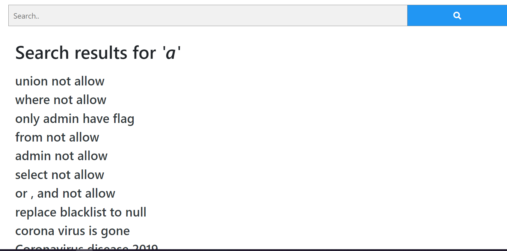
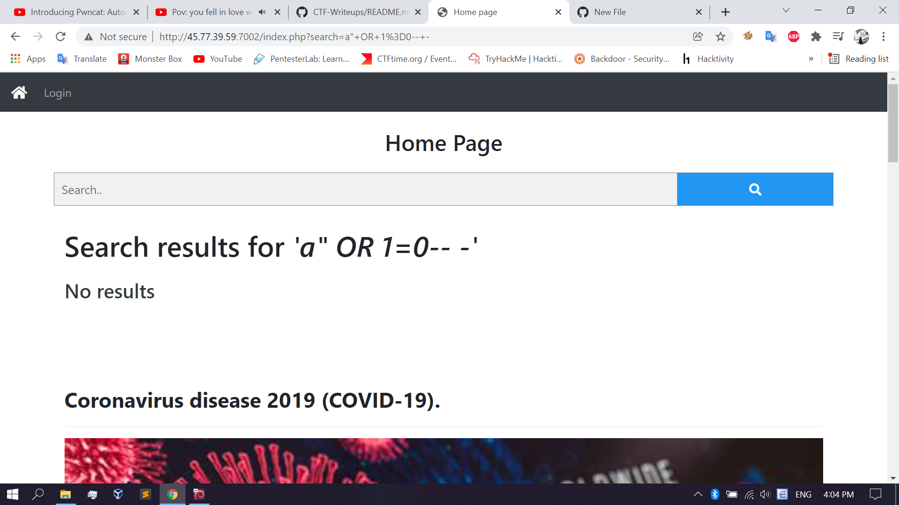
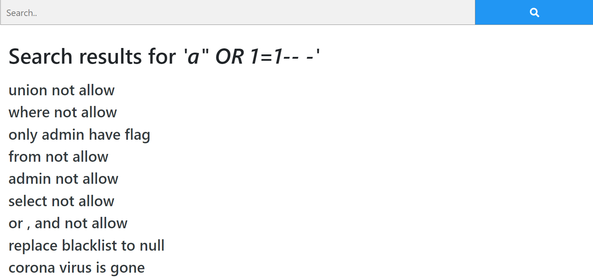
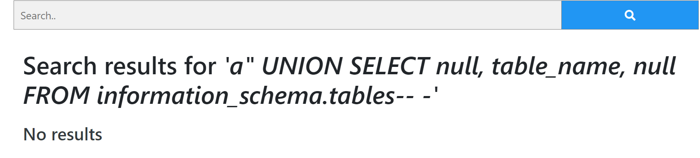
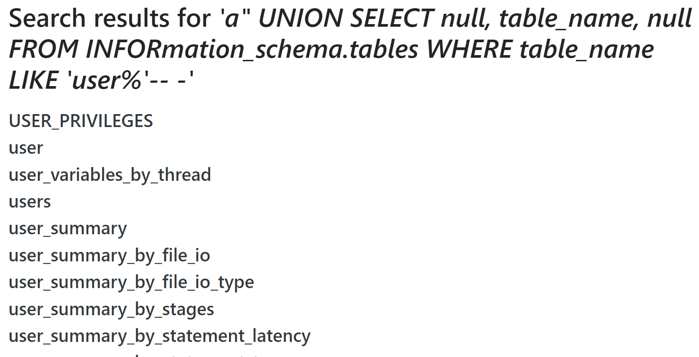
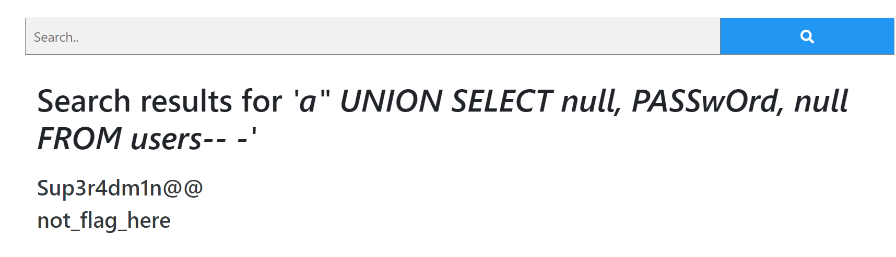
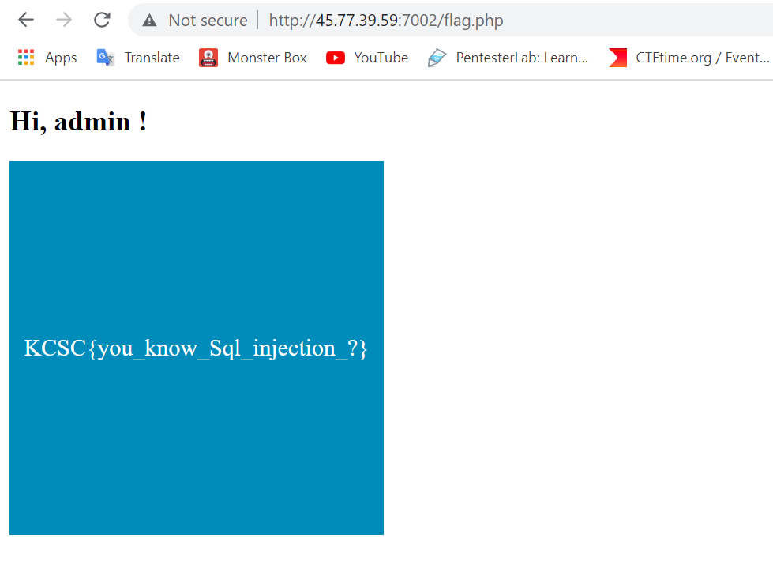

# KCSC Recruit Members - Baby SQL

## Description
http://45.77.39.59:7002

**Author**: `cookie`

**Hint**: Kết quả tìm kiếm có thể chứa thứ bạn cần hãy chú ý vào nó !!!
## Solution
Không giải được bài này là do giai đoạn enumeration chưa tới. Hầu hết các trường hợp tìm kiếm đều trả về `no results`, may mắn trigger được `a` trả về các kết quả tìm kiếm trong đó gợi ý các `statement` bị replace về null.

Inject bằng `single quote` chẳng có tiến triển gì, đây có lẽ là hố đen khiến nhiều người thiếu kiên nhẫn bỏ cuộc.

Thử sang `double quote`

Để bypass có thể thử `oORr` nhưng không được, có lẽ replace null là `null` chứ không phải xóa đi, đơn giản chỉ cần viết hoa, sql `case-sensitive` khá thoải mái.

Trigger thành công, build payload thôi!

Thử query `information_schema` mà không được, có lẽ dính `blacklist
`
Trước nay cứ tưởng `table name, column, database` trong SQL mặc định case-sensitive nhưng thật  phụ thuộc cấu hình, đúng hơn thì `(Đối với MySQL)Database and table names are not case sensitive in Windows, and case sensitive in most varieties of Unix or Linux`. Thử thôi.

Viết hoa `INFORmation_schema` rồi query thì bypass được thật.

List table, tìm table nào `like 'user%'` thì tìm được `users`

Tìm đươc table tìm tiếm column_name thì được `id, username, password`. Query user gồm có `admin, test`.

Query đến password lại dính blacklist, lại viết hoa lên để bypass, thế là có password, log in thôi.

Log in với: `admin:Sup3r4dm1n@@`

**Flag**: `KCSC{you_know_Sql_injection_?}`
